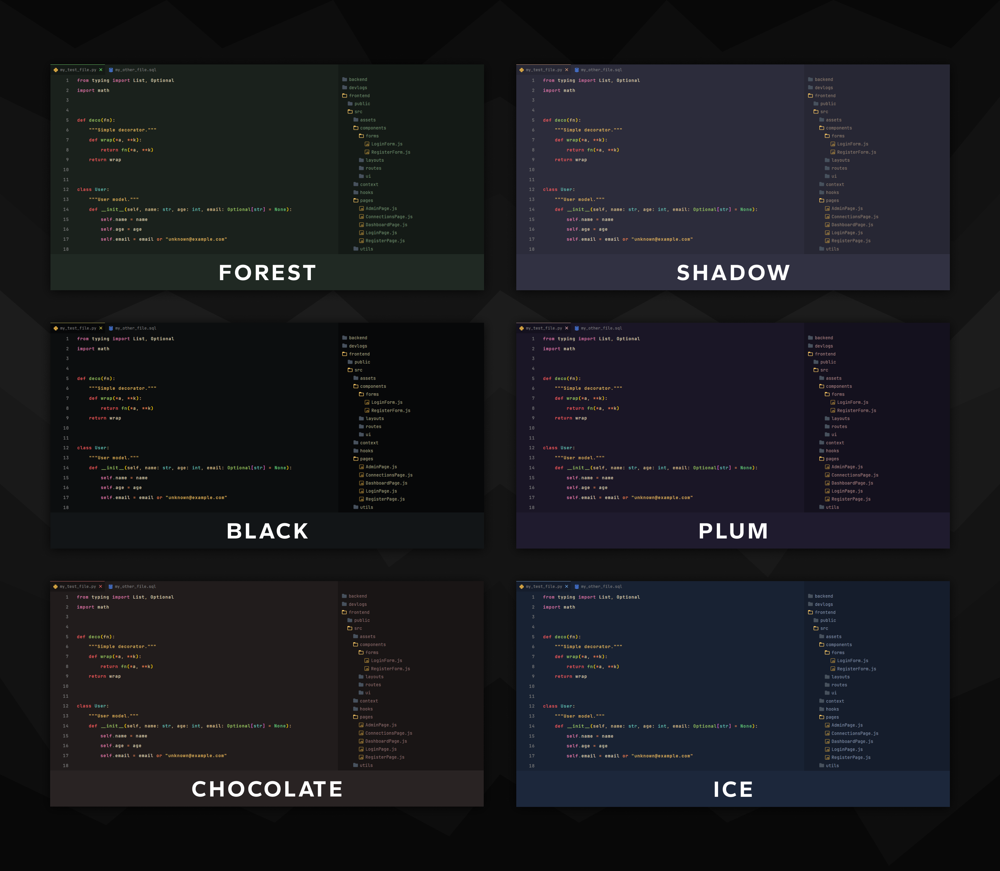

# Syl Themes

Your average theme, nice colors tho! A set of dark themes with 6 variants to pick from.

Font used in screenshots: JetBrainsMono Nerd Font Mono

## 🚀 Installation

-   Open the Extensions sidebar in VS Code
-   Search for `Syl Themes`
-   Click Install
-   Open the Command Palette with `Ctrl+Shift+P`
-   Select **Preferences: Color Theme** and choose your variant

## 🐛 Issues

Something look off? [Open an issue](https://github.com/ItzSylex/syl-themes-vscode/issues) and I'll take a look.
